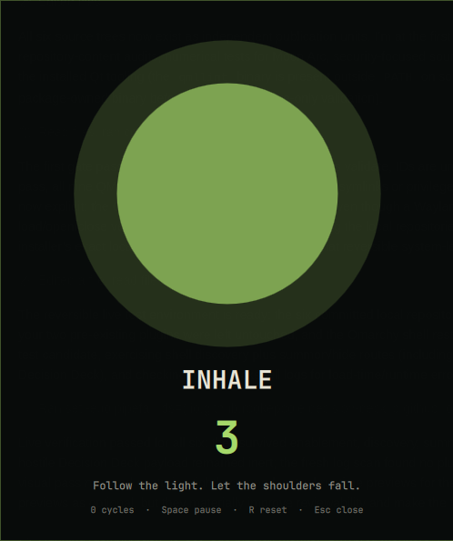

# Zen Breather

A calm, full-screen breathing guide for Omarchy Quattro. It cycles through inhale 4s, hold 4s, exhale 6s, and rest 2s while a theme-colored orb expands and settles.



## Install

```sh
omarchy plugin add https://github.com/rookepoole/omarchy-zen-breather.git --enable
```

## Open and use

```sh
omarchy-shell shell summon io.github.rookepoole.zen-breather '{}'
```

- Space pauses/resumes.
- `R` resets the cycle counter.
- Escape or the dark backdrop closes the overlay.

Bind the summon command to any Hyprland shortcut you like.

## Dependencies and permissions

Requires only Omarchy Quattro and its Qt/Quickshell runtime. It launches no commands, makes no network requests, requests no privileges, and writes no files. This is a relaxation aid, not medical treatment; stop if breathing exercises make you uncomfortable.

## Remove

```sh
omarchy plugin remove io.github.rookepoole.zen-breather
```

## License

MIT © 2026 Rooke Poole.
